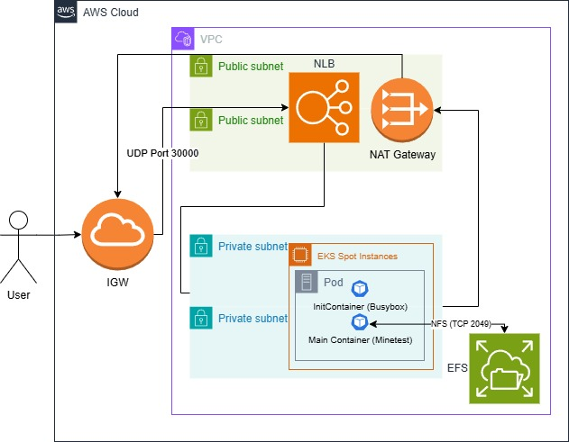

# SL-Minetest-Spot-On-Server 🚀

> 一个基于 AWS EKS 与 EFS 的高可用、低成本、全自动云原生游戏服务器。

## 🌟 项目亮点 (Project Highlights)

- **极致成本优化**: 利用 **AWS Spot Instances** 节约了超过 70% 的计算成本。
- **数据永不丢失**: 通过 **AWS EFS** 实现跨可用区 (Multi-AZ) 的有状态数据持久化。
- **工业级 CI/CD**: 整合 **GitHub Actions**，实现代码推送即自动触发：镜像打包 -> 安全扫描 -> 滚动更新部署。
- **基础设施即代码 (IaC)**: 全栈资源（VPC, EKS, EFS, ECR）均通过 **CloudFormation** 与 **Makefile** 自动化管理。

## 🏗️ 系统架构图 (Architecture)

**流量走向**: 外网 → NLB → EKS Private Subnets → EFS



## 🔄 CI/CD Pipeline


## 🛠️ 技术栈 (Tech Stack)

- **Containerization**: Docker
- **Orchestration**: Kubernetes (AWS EKS)
- **Storage**: AWS EFS (Elastic File System)
- **Infrastructure**: AWS CloudFormation, VPC, IAM
- **Automation**: GitHub Actions, Makefile
- **Security**: Kube-linter, InitContainers (Permission hardening)

## 🚀 快速开始 (Quick Start)

本项目提供了高度自动化的 `Makefile` 脚本，支持一键部署：

1. **配置环境**: 确保本地已安装 AWS CLI 和 kubectl。

2. **一键起楼**:
   ```bash
   make deploy-all
   ```

3. **获取地址**: 部署完成后运行以下命令获取游戏服务器 IP：
   ```bash
   make get-ip
   ```

4. **安全关机**: 为了节省费用，不玩时请执行：
   ```bash
   make destroy-all
   ```

## 🧠 核心技术挑战与解决方案 (Technical Challenges)

### 1. 有状态应用的持久化权限陷阱

**挑战**: EFS 挂载到容器后，默认所有者为 Root，导致非 Root 运行的游戏进程 (minetestuser) 无法写入存档。

**解决**: 引入 InitContainer (BusyBox)，在主程序启动前以 Root 身份执行 `chmod 777` 预处理权限，确保业务容器顺利运行。

### 2. Spot 实例的波动与自愈

**挑战**: Spot 实例随时可能被 AWS 回收。

**解决**: 结合 EKS Managed Node Groups 的自愈能力，配合 EFS 独立存储。即使节点被回收，K8s 也会在 1 分钟内自动拉起新节点并重新挂载存档，实现近乎零丢失的玩家体验。

### 3. CI/CD 安全审查 (DevSecOps)

**挑战**: 如何确保部署到集群的 YAML 符合安全规范？

**解决**: 在 GitHub Actions 中集成 Kube-linter。尽管我们在本项目中为了功能实现显式豁免了部分规则（如 Root 执行权限），但这种"已知风险并受控"的处理方式体现了严谨的工程态度。
